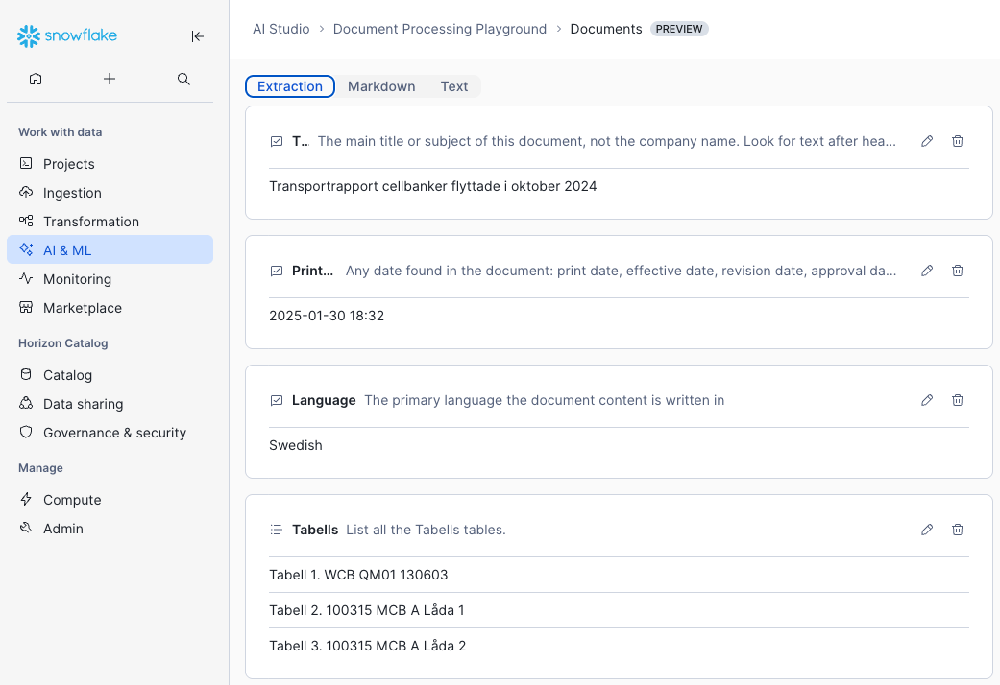
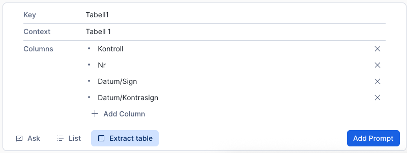
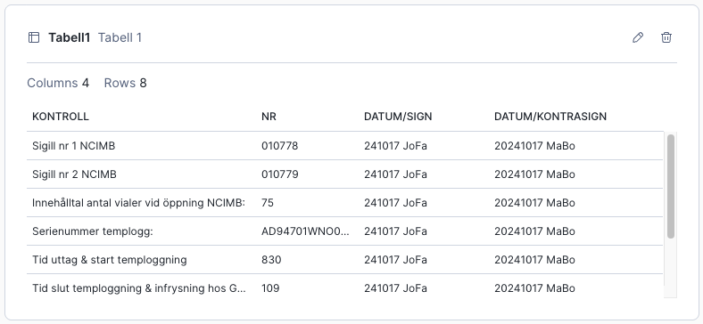
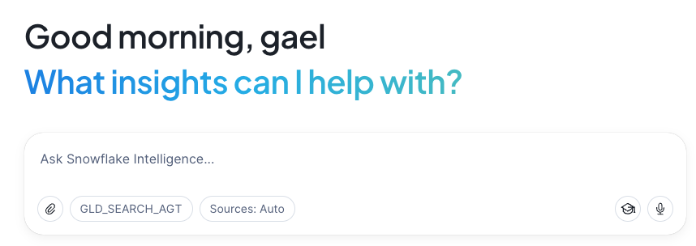

# Document Search with Signature Extraction

Upload and parse PDF documents to Snowflake using AI_PARSE_DOCUMENT, extract metadata and **handwritten signatures** using AI_EXTRACT, generate summaries with AI_COMPLETE, and enable semantic search with Cortex Search.

## Features

- **Document Parsing**: Extract text from PDFs using OCR or Layout mode
- **Metadata Extraction**: Automatically extract title, date, and language
- **Handwritten Signature Extraction**: Detect and extract signer names, titles, and dates
- **AI Summaries**: Generate concise document summaries using Claude 3.5 Sonnet
- **Semantic Search**: Search documents by meaning, not just keywords

## Prerequisites

- [Snow CLI](https://docs.snowflake.com/en/developer-guide/snowflake-cli-v2/index) installed and configured
- Snowflake account with Cortex AI features enabled

## Quick Start: All-in-One OCR Script

For the fastest setup with signature extraction, use the all-in-one script:

```bash
snow sql -f all_in_one_ocr.sql
```

This single script will:
1. Parse documents using OCR mode
2. Extract metadata (title, date, language)
3. Generate AI summaries
4. **Extract handwritten signatures** (Name | Title | Date)
5. Clean and validate signature data
6. Create searchable chunks with embedded signatures
7. Create Cortex Search service for semantic search

**Configuration** (edit at the top of `all_in_one_ocr.sql`):
```sql
SET SF_DATABASE = 'DOCS';
SET SF_SCHEMA = 'PUBLIC';
SET SF_STAGE = '@DOCS.PUBLIC.STG';
SET SF_FOLDER = '%';  -- Use 'folder/%' to limit scope
```

---

## Step-by-Step Approach

If you prefer running each step separately:

### 1. Create Database, Schema, and Stage

```bash
snow sql -f 1_setup.sql
```

### 2. Upload PDF Files

Place PDFs in `./data` directory and run:

```bash
./upload_to_snowflake.sh
```

### 3. Parse Documents

```bash
snow sql -f 2_ai_parse.sql --database DOCS --schema PUBLIC
```

### 4. Extract Metadata and Summaries

```bash
snow sql -f 3_ai_extract.sql --database DOCS --schema PUBLIC
```

### 5. Extract Handwritten Signatures

```bash
snow sql -f 5_ai_signatures.sql --database DOCS --schema PUBLIC
```

### 6. Create Cortex Search Service

```bash
snow sql -f 4_cortex_search.sql --database DOCS --schema PUBLIC
```

---

## Document Processing Playground

For a visual, no-code approach, use **AI Studio > Document Processing Playground** in Snowsight.

**Capabilities:**
- Extract structured data from documents using `AI_EXTRACT`
- Parse and extract content from PDFs using `AI_PARSE_DOCUMENT`
- Interactive UI to test and preview results
- Extract tables containing handwritten content



**Example: Table Extraction**

| Extraction Setup | Extracted Result |
|------------------|------------------|
|  |  |

---

## Handwritten Signature Extraction

### How It Works

The signature extraction uses `AI_EXTRACT` with a structured JSON schema to identify handwritten signatures throughout documents (excluding dedicated Signatures Pages):

```sql
AI_EXTRACT(
    file => TO_FILE('@STAGE', filepath),
    responseFormat => PARSE_JSON('{
        "schema": {
            "type": "object",
            "properties": {
                "hand_signatures": {
                    "description": "List handwritten signatures on all pages except the dedicated Signatures Pages. For each, Return: [Name] | [Short Title] | [Date].",
                    "type": "array",
                    "items": {"type": "string"}
                }
            }
        }
    }')
)
```

### Signature Data Cleaning

Extracted signatures are automatically cleaned to ensure quality:
- **Valid signatures** must have a real name AND a real date
- Entries with `None` for name or date are filtered out
- Documents with no valid signatures have `hand_signatures` set to `NULL`
- Title is optional (signature is kept if name and date are valid)

---

## AI Functions Used

### AI_PARSE_DOCUMENT

Extracts text from PDFs with two modes:

| Mode | Best For | Description |
|------|----------|-------------|
| **LAYOUT** | Complex documents | Optimized for tables, forms, structured layouts |
| **OCR** | Text-heavy documents | Fast, high-quality text extraction from manuals, contracts, policies |

```sql
AI_PARSE_DOCUMENT(
    TO_FILE('@STAGE', filepath),
    { 'mode': 'OCR', 'page_split': true }
)
```

### AI_EXTRACT

Extracts structured data from documents:

```sql
AI_EXTRACT(
    TO_FILE('@STAGE', filepath),
    OBJECT_CONSTRUCT(
        'title', 'Document title...',
        'print_date', 'Document date...',
        'language', 'Primary language...'
    )
)
```

**Limitations:**
- `TO_FILE` supports documents up to 125 pages
- Larger documents fall back to parsed content extraction

### AI_COMPLETE

Generates summaries using Claude 3.5 Sonnet:

```sql
AI_COMPLETE(
    'claude-3-5-sonnet',
    CONCAT('Provide a brief 2-3 sentence summary...', content)
)
```

---

## File Structure

```
.
├── README.md                 # This file
├── all_in_one_ocr.sql        # Complete pipeline with OCR and signatures
├── 1_setup.sql               # Database, schema, stage creation
├── 2_ai_parse.sql            # Document parsing (LAYOUT mode)
├── 3_ai_extract.sql          # Metadata extraction and summaries
├── 4_cortex_search.sql       # Chunking and Cortex Search service
├── 5_ai_signatures.sql       # Handwritten signature extraction
├── upload_to_snowflake.sh    # Upload script for PDF files
└── data/                     # PDF files to upload (not tracked in git)
```

---

## Table Schemas

### parsed_document_ocr

| Column | Type | Description |
|--------|------|-------------|
| `filepath` | VARCHAR | Full relative path |
| `filename` | VARCHAR | Just the filename |
| `page_count` | INT | Total pages in document |
| `page_index` | INT | Current page index (0-based) |
| `page_content` | VARCHAR | Extracted page text |
| `title` | VARCHAR | Document title (from AI_EXTRACT) |
| `print_date` | VARCHAR | Document date (from AI_EXTRACT) |
| `language` | VARCHAR | Document language (from AI_EXTRACT) |
| `summary` | VARCHAR | Document summary (from AI_COMPLETE) |
| `hand_signatures` | VARIANT | Array of signatures: `["Name \| Title \| Date", ...]` |
| `parsed_at` | TIMESTAMP | When the document was parsed |

### doc_chunks_ocr_signature

| Column | Type | Description |
|--------|------|-------------|
| `filepath` | VARCHAR | Full relative path |
| `filename` | VARCHAR | Just the filename |
| `page_index` | INT | Page index (0-based) |
| `page_count` | INT | Total pages in document |
| `title` | VARCHAR | Document title |
| `print_date` | VARCHAR | Document date |
| `language` | VARCHAR | Document language |
| `summary` | VARCHAR | Document summary |
| `hand_signatures` | VARIANT | Array of signatures |
| `presigned_url` | VARCHAR | Presigned URL to access document |
| `chunk` | VARCHAR | Searchable chunk with embedded signatures |
| `chunk_index` | INT | Chunk index within page |

---

## Snowflake Intelligence Agent

Create an AI-powered conversational agent that uses your Cortex Search service to answer questions about your documents.

**Access:** Snowsight → AI & ML → Agents

**Steps:**
1. Navigate to **AI & ML > Agents** in Snowsight
2. Click **Create Agent**
3. Add your Cortex Search service as a tool:
   - Select `document_search_ocr_signature` service
   - Configure which columns to return
4. Test with questions about your documents



---

## Example Queries

### Document Metadata

```sql
-- List all parsed documents with metadata
SELECT DISTINCT 
    filename, 
    title, 
    print_date, 
    language, 
    page_count,
    CASE WHEN hand_signatures IS NOT NULL THEN 'Yes' ELSE 'No' END AS has_signatures
FROM parsed_document_ocr 
WHERE page_index = 0
ORDER BY filename;

-- Documents by language
SELECT language, COUNT(DISTINCT filename) AS document_count
FROM parsed_document_ocr
WHERE page_index = 0
GROUP BY language
ORDER BY document_count DESC;
```

### Semantic Search

```sql
-- Search for clinical protocols
SELECT PARSE_JSON(
    SNOWFLAKE.CORTEX.SEARCH_PREVIEW(
        'document_search_ocr_signature',
        '{
            "query": "clinical trial protocol phase 3",
            "columns": ["filepath", "filename", "title", "chunk"],
            "limit": 10
        }'
    )
):results AS search_results;

-- Search with language filter
SELECT PARSE_JSON(
    SNOWFLAKE.CORTEX.SEARCH_PREVIEW(
        'document_search_ocr_signature',
        '{
            "query": "quality control manufacturing",
            "columns": ["filepath", "filename", "title", "chunk"],
            "filter": {"@eq": {"language": "English"}},
            "limit": 10
        }'
    )
):results AS search_results;
```
